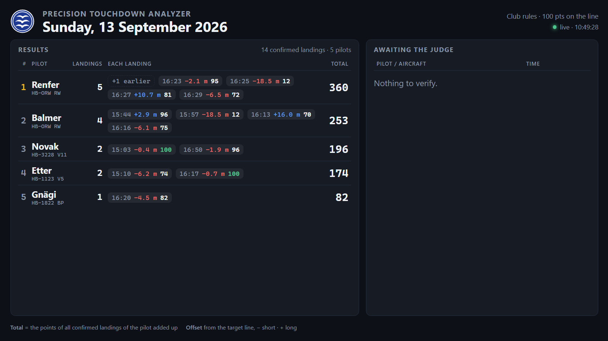
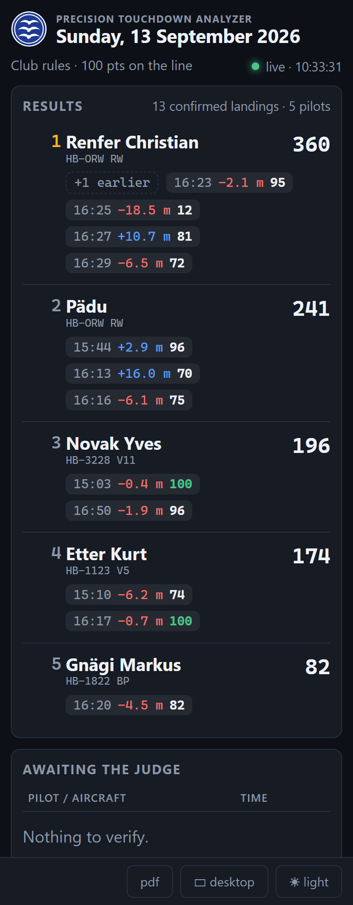

# Precision Touchdown Analyzer

Measures airplane spot landings from one fixed camera: where the main wheel first
touched the ground, in metres from the target line, with a clip and a proof
image per landing, an aircraft identification from OGN, and points under the
club's scoring rules. Built for the Ziellandewettbewerb at LSTB (Bellechasse).

The camera films the touchdown zone continuously. A recorder writes the stream
to disk in 10 s segments (configurable); the analyzer reads those segments, finds every
aircraft, tracks its wheel to the instant of contact and maps that pixel onto
the ground plane through a one-time calibration. A judge confirms each landing
in the browser.

<p align="center">

  <br><em>The judge's Landings page: the contact frame with the geometry drawn in, the measurement, the OGN proposal to confirm, and every event of the session.</em>
</p>

<p align="center">
  
  <br><em>The results board for the big screen: pilots ranked by their total (or their mean, as the rules say), each landing with its offset and points.</em>
</p>

<p align="center">
  
  <br><em>The small display of the board, as a phone shows the public scoreboard.</em>
</p>


## Install

**Windows** - run `PTA-Setup-<version>.exe`. It installs for all users to
`C:\Program Files\PTA`, adds Start menu and desktop shortcuts and an entry in *Apps &
features*. The configuration lives in `C:\Users\<you>\PTA`, which the
uninstaller leaves alone. The **Recordings** and **Results** folders are chosen
in the control window that opens first (default `data\raw` and `data\landings`
there) - put the recordings on the disk with room for video. A program folder
under your own profile installs per user, without the prompt. Unattended:
`PTA-Setup-<version>.exe /S [/D=C:\path] [/DATA=D:\path] [/NODESKTOP] [/NOMENU]`.

**Debian / Ubuntu** (amd64, Python 3.12 or 3.13):

```sh
sudo apt install ./pta_<version>_amd64.deb   # asks for the data directory (default /var/lib/pta)
sudo systemctl enable --now pta              # web server on port 8080
sudo dpkg-reconfigure pta                    # point it at another data directory later
```

The package carries its wheels and builds a venv under `/opt/pta` on install,
so no network is needed on the target machine; `ffmpeg` is a dependency. The
data directory is kept in `/etc/default/pta` and belongs to the system user
`pta`, which runs the service; the account that ran the install is added to
group `pta` so the control window (application menu, or `pta` on the command
line) works on the same recordings after the next login.

**From source** - Python 3.12+, [ffmpeg](https://ffmpeg.org/) on `PATH`:

```powershell
py -m venv .venv
.\.venv\Scripts\Activate.ps1
pip install -r requirements-dev.txt
pip install -e ".[ui,analysis]"
```

## Run

The installed program opens a **control window**: start and stop the web
server, choose the port and whether it is reachable from other devices on the
network, set the airfield for OGN identification (type the ICAO code, *Look
up* fetches position, elevation and time zone from the OGN FlightBook, *Save*
writes `config/ogn.json` and hands it to the running server), name the relay
the public scoreboard is pushed to (*Public scoreboard*: the Raspberry Pi's
push port and its token, see [`ptp-relay/`](ptp-relay/README.md)), and watch
the services - recorder, analysis worker, OGN feed, calibration, public
board, ffmpeg - with the server log underneath. From a checkout the same
window is `touchdown-analyzer launcher`.

*Export settings…* writes the site's settings to one `*.pta` file (a zip):
calibration with its still, airfield, scoring rules, folders, the camera URL
and the relay's address and token - everything in `config/` and the site's
entries of `.env`, no recordings or results. *Import settings…* (with the
server stopped) takes such a file over on another machine or after a
reinstall; the settings it replaces go to `backups/` first, as a `.pta` to
import back. The file holds the camera password and the relay token: keep it
like a password.

Without the window:

```powershell
touchdown-analyzer serve            # http://localhost:8080
touchdown-analyzer serve --host 0.0.0.0   # reachable from the field WiFi (no login - trusted networks only)
```

With `RELAY_URL` and `RELAY_TOKEN` in `.env` (or the environment) the server
pushes the public board to the relay as well - the launcher writes them there.

| Program | Description |
| --- | --- |
| **Calibration** | Once per camera position: grab a still, click the surveyed markers (three pairs, one on each strip edge), solve. Aim for a residual under 0.10 m. |
| **Capture** | Pre-flight check of the camera, start/stop the recording, live viewfinder, disk and frame-rate status. |
| **Frames** | Step through a segment frame by frame and hand-mark a touchdown (the ground truth the analysis is scored against). |
| **Landings** | The judge's page: every event of the day with its measured offset, the contact frame with the geometry drawn on, a scrubber and loop, a magnifier, the OGN proposal, the pilot's name (suggested from the aircraft's previous landing), and *Confirm / Reject / Use this frame*. *Analyse session* processes a finished day; *Follow recording* analyses while recording. |
| **Scoring** | The club's rules - points on the line, deduction per metre short and per metre long, floor, decimals, and whether a pilot who lands more than once is ranked by the sum or the mean of their landings - with the scale drawn out and the day's ranking. |
| **Board** (`/board`) | Read-only results for a big screen: one row per pilot (the name the judge entered; the aircraft where none) with the number of confirmed landings, each landing's offset and points, and the result that ranks it (the points added up over all its landings, or their mean, as set on the Scoring page); the unverified landings listed beside without distance or score; refreshed every 5 s, follows the newest session. `?session=2026-09-13`, `?theme=light`, `?refresh=10`, `?page=8` (seconds per page when the list is long). On a phone (narrower than 760 px), or with `?layout=mobile`, the small display: one column to scroll through instead of pages (the picture at the top); the button on the lower edge switches between the two. |
| **Public board** (`/public`) | The same board for the internet, reading only `/api/public/board` (no tracks, notes or file paths) and offering the PDF. Put on the internet through the relay in [`ptp-relay/`](ptp-relay/README.md): the analyzer pushes the page, the boards and the ranking PDFs every few seconds to nginx in Docker on a Raspberry Pi, which serves them read-only and nothing else, shows the board at its root, and can add HTTPS with the certificate the domain's provider issues. The Pi never calls the judge PC - whose address may change, and which can stay on `127.0.0.1`. When the pushes stop, the board there says "not active" after 30 s. |

The same things from the command line:

```powershell
touchdown-analyzer probe                       # is the camera set up right? (60 fps, no Zipstream...)
touchdown-analyzer record --session 2026-09-13 # record until Ctrl+C
touchdown-analyzer index --session 2026-09-13  # continuity report of a session
touchdown-analyzer analyze --session 2026-09-13 [--fresh] [--no-clips]
```

The camera URL is given once with `--source` (or in the UI) and remembered in
`.env`, which is git-ignored because it carries the camera password. The
relay's address and push token (`RELAY_URL`, `RELAY_TOKEN`) are kept there too.

## What comes out as results

```
data/raw/<session>/         10 s segments, session.json, segments.jsonl, recorder.log
data/landings/<session>/    landings.json - every event, measurement, judge's decision, history
                            <time>_<REG>_overlay.jpg - the contact frame with the geometry drawn in
                            <time>_<REG>.mp4 - the pass, 1 s either side of the wheel over the ruler
                            ranking.xlsx, ranking.pdf - the board's ranking, rewritten on every change
config/calibration.json     the ground-plane mapping           config/scoring.json   the scoring rules
config/ogn.json             the airfield for OGN identification
```

Every measured landing carries an uncertainty. Landings outside the ±19 m
window are reported as a bound (`< −19 m`, `> +19 m`); a wheel that skims the
whole window too low to tell from rolling is reported as *pick frame* for the
judge; take-offs and fly-throughs are listed but not scored.

## Algorithm description

Background subtraction finds the aircraft; inside its box the pixels are split
into aircraft and shadow; the black tyre is found along the belly and tracked
as an object through the pass. Two independent cues give the contact instant
at sub-frame resolution - the reach of the shadow under the wheel, which stops
shrinking at contact, and the wheel's apparent depth through the calibration,
which stops moving at contact - and their spread is the uncertainty. The OGN
FlightBook gives the registration and settles landing versus take-off from the
logbook minute. The full method, the error budget and what the first footage
taught are in [`docs/design.md`](docs/design.md).

Accuracy today is limited by the calibration (2.25 m residual against a 0.10 m
target) and a low tripod; a proper survey and the planned 8 m mast are what
bring it to ±0.25 m the design is built for.

## Development

```powershell
pytest              # tests
ruff check .        # lint
ruff format .       # format
mypy                # types
```

`capture/`, `clips/`, `identify/` and `store/` are stdlib-only so the recorder
can never fail to import at the airfield; OpenCV arrives only with `analysis/`.
Raw video and results stay out of git.

Building the installers (outputs land in `dist/`):

```powershell
.\packaging\windows\build.ps1           # PyInstaller -> Setup exe; downloads ffmpeg into vendor\ffmpeg\ and bundles it (-NoFfmpeg to skip)
python packaging\debian\build_deb.py    # downloads the wheels from PyPI, writes the .deb (works on Windows too)
```

The .deb is assembled with the standard library and has so far only been
checked structurally on Windows; the first install on a real Debian machine
should be watched (`journalctl -u pta`).
